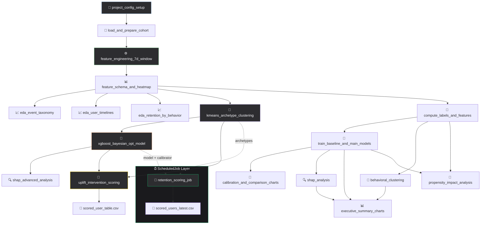

# BuilderFlow: Zerve 2026 Hackathon

> **Bridging the gap between AI generation and platform retention.**

## 📊 TL;DR

We analyzed 226.6K behavioral events from 1,472 users to identify what separates power users from churners. Using 51 leakage-free features from the first 7 days of activity, we built a calibrated XGBoost model (PR-AUC 0.269) that identifies users 2.56× more likely to retain. We discovered 6 behavioral archetypes; from "Hands-On Builders" (81% retention) to "Casual Browsers" (4%); and prioritized 4 concrete product interventions with measurable uplift estimates.

📄 **[Read the full Written Summary →](builderflow/WRITTEN_SUMMARY.md)** (question, methodology, findings)

## 🏗️ Project Structure

```
builderflow/
├── canvas.yaml                    # Canvas definition & DAG
├── Development/                   # Main analysis layer (20 blocks)
│   ├── project_config_setup.py         # Config & data loading
│   ├── load_and_prepare_cohort.py      # Cohort filtering
│   ├── feature_engineering_7d_window.py # 51 features from 7-day window
│   ├── feature_schema_and_heatmap.py   # Schema validation & correlation
│   ├── kmeans_archetype_clustering.py  # 6 behavioral archetypes
│   ├── xgboost_bayesian_opt_model.py   # XGBoost + Bayesian HPO
│   ├── shap_advanced_analysis.py       # SHAP interpretability
│   ├── uplift_intervention_scoring.py  # 4 interventions, priority ranking
│   ├── executive_summary_charts.py     # Executive dashboard
│   ├── executive_narrative.md          # Written report
│   └── ... (EDA, baseline models, calibration, propensity analysis)
├── ScheduledJob/                  # Deployed scoring pipeline
│   ├── retention_scoring_job.py        # Daily user risk scoring
│   └── layer.yaml                      # Schedule configuration
└── REPRODUCTION_GUIDE.md           # Step-by-step reproduction guide
```

## 🔄 Pipeline Architecture



## 🔑 Key Results

| Metric | Value |
|--------|-------|
| PR-AUC (XGB Calibrated) | **0.269** |
| Lift @ Top 10% | **2.56×** |
| Rolling CV PR-AUC | 0.249 ± 0.058 |
| Brier Score (calibrated) | **0.013** |
| Archetypes | **6** (stable, silhouette=0.52) |
| Top Driver | `active_days` (SHAP=0.229) |
| #1 Intervention | Agent→Block UI (+21 retained users) |

## 🚀 Deployed Functionality

**Scheduled Job**: Daily retention scoring pipeline that re-scores all users, assigns risk tiers, and outputs CSV for the product team.

## 📝 How to Reproduce

See [REPRODUCTION_GUIDE.md](builderflow/REPRODUCTION_GUIDE.md) for step-by-step instructions.

## 🛠️ Tech Stack

- **Python** (pandas, numpy, scikit-learn, xgboost, matplotlib)
- **Zerve Platform** (Canvas, Code Blocks, Scheduled Jobs)
- **Techniques**: Temporal train/test split, Bayesian HPO, isotonic calibration, SHAP TreeExplainer, K-Means clustering, propensity score analysis, uplift estimation

## 📄 License

MIT License: see [LICENSE](LICENSE)
